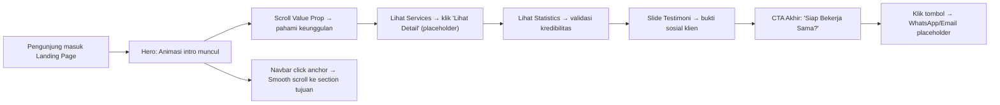

# PRD (Product Requirements Document) — Terra Tech Company Profile Landing Page

## 1. Product Overview

**Terra Tech** adalah perusahaan teknologi yang menyediakan solusi digital terintegrasi (pengembangan web, aplikasi mobile, desain UI/UX, dan konsultasi IT). Website company profile ini bertujuan untuk membangun kredibilitas online, menampilkan portofolio & layanan unggulan, serta menarik calon klien baru melalui landing page yang modern dan profesional.

- **Tujuan**: Menjadi landing page pertama yang dikunjungi calon klien untuk mengenal Terra Tech, melihat layanan yang ditawarkan, bukti sosial (testimoni & statistik), dan terdorong untuk menghubungi tim.
- **Target Pengguna**: Calon klien perusahaan (B2B), startup founder, manajer operasional yang mencari vendor pengembangan solusi digital.
- **Nilai Pasar**: Tampilan modern tema dark futuristik dengan aksen neon mencerminkan karakter Terra Tech sebagai solusi teknologi yang canggih, terpercaya, dan berbeda dari kompetitor.

---

## 2. Core Features

### 2.1 User Roles (Tidak ada sistem login)
| Role | Akses | Fitur |
|------|-------|-------|
| Guest / Pengunjung | Semua halaman publik | Melihat seluruh section landing page, klik tombol CTA (WhatsApp/Email placeholder), scroll smooth, animasi on-scroll. |

### 2.2 Feature Module
1. **Navbar Component** (reusable): Logo Terra Tech, menu navigasi, sticky saat scroll, hamburger menu mobile.
2. **Hero Section**: Headline bold, subheadline deskriptif, 2 tombol CTA (primer & sekunder), visual ilustrasi tech.
3. **Value Proposition Section**: 4 blok ikon + judul + deskripsi (Berpengalaman, Tepat Waktu, Kualitas Terjamin, Harga Kompetitif).
4. **Services Section**: 4 kartu layanan unggulan + gambar/ikon + tombol "Lihat Detail" (placeholder).
5. **Statistics Section**: 4 angka besar dengan animasi hitung (150+ Klien, 99% Kepuasan, 50+ Proyek, 8+ Tahun Pengalaman).
6. **Testimonials Carousel**: 5+ kartu testimoni dengan slider/auto-play (foto, nama, jabatan, bintang 5).
7. **Call to Action Akhir**: Banner gradien besar "Siap Bekerja Sama?" + tombol CTA besar.
8. **Footer Component** (reusable): Logo, tautan cepat, kontak (placeholder), sosial media, copyright.
9. **Back to Top Button**: Fixed di kanan-bawah, muncul saat scroll > 500px.
10. **Smooth Scroll Animations**: Fade-in + slide-up saat section masuk viewport.

### 2.3 Page Details
| Page Name | Module Name | Feature Description |
|-----------|-------------|---------------------|
| Landing Page `/` | Navbar | Sticky top, transparan di hero, solid setelah scroll, highlight menu aktif, hamburger di breakpoint <768px |
| Landing Page `/` | Hero | Gradient mesh background, headline max 2 baris, CTA ganda, gambar ilustrasi tech di samping kanan |
| Landing Page `/` | Value Proposition | 4 kolom desktop, 2 kolom tablet, 1 kolom mobile, ikon bulat background aksen |
| Landing Page `/` | Services | 4 kartu dengan gambar header, hover effect scale + shadow, tombol Lihat Detail |
| Landing Page `/` | Statistics | 4 kolom angka besar, counter animation saat masuk viewport |
| Landing Page `/` | Testimonials | Carousel auto-play 5s, dot indicator, left-right arrow, kartu dengan border glow aksen |
| Landing Page `/` | CTA Akhir | Full-width banner, background gradient dark-to-accent, dua tombol (WhatsApp + Email) |
| Landing Page `/` | Footer | 4 kolom: Brand, Navigasi, Kontak, Sosmed. Minimalis, link placeholder |
| Landing Page `/` | Back to Top | Fixed tombol lingkaran neon, smooth scroll ke atas saat diklik |

---

## 3. Core Process

Alur utama pengunjung sejak memasuki website:

1. Pengunjung membuka URL landing page.
2. Page load dengan staggered animation (Navbar muncul, Hero fade-in, Value Prop slide-up).
3. Pengunjung scroll ke bawah: tiap section trigger fade-in on-scroll.
4. Pengunjung membaca Value Proposition → memahami keunggulan Terra Tech.
5. Pengunjung melihat Services section → tertarik dengan salah satu layanan → klik "Lihat Detail" (tampil toast/modal placeholder "Detail halaman sedang dikembangkan").
6. Pengunjung melihat Statistics → validasi track record Terra Tech.
7. Pengunjung melihat Testimonials slider → bukti sosial dari klien sebelumnya.
8. Pengunjung scroll ke CTA Akhir → terdorong klik "Hubungi Kami" → redirect ke WhatsApp placeholder atau Email placeholder.
9. Atau, pengunjung menggunakan Navbar untuk lompat ke section tertentu via smooth anchor scroll.

---

## 4. User Interface Design

### 4.1 Design Style
- **Tema Utama**: Gelap Modern (Dark Futuristic Tech)
- **Palette Warna**:
  - Primary Dark: `#0a0b14` (Background utama)
  - Surface Dark: `#11131f` (Card/section backgrounds)
  - Border Dark: `#1e2139` (Divider & card border)
  - **Aksen Utama Cyan Neon**: `#00e5ff` (CTA button, link hover, border glow, icon color)
  - Aksen Sekunder Ungu: `#a855f7` (Gradient tambahan, highlight)
  - Teks Putih: `#f0f4f8` (Heading)
  - Teks Abu Muda: `#94a3b8` (Body text)
  - Teks Abu Tua: `#64748b` (Caption, placeholder)
- **Button Style**: 
  - Primer: Solid fill cyan `#00e5ff`, rounded-xl, teks gelap di atasnya, hover lift-up + glow shadow cyan.
  - Sekunder: Outline 1px cyan transparan, hover isi ringan cyan.
  - Semua tombol transition 300ms ease-out.
- **Tipografi**:
  - Display/Heading Font: `Space Grotesk` (bold, geometric tech vibe)
  - Body Font: `Inter` (readability tinggi)
  - Heading sizes: Hero 64px→36px responsive, Section 40px→28px, Card 20px
  - Body: 16px line-height 1.6
- **Layout Style**:
  - Container max-width: 1200px, auto margin.
  - Section spacing: 96px top + 96px bottom (desktop), 64px (mobile).
  - Card-based untuk services & testimonials, elevated dengan subtle shadow.
- **Ikon**: Pakai `lucide-react` (stroke style, 24px default, warna cyan aksen untuk heading).
- **Efek Khusus**:
  - Background hero: Gradient mesh (dark + cyan blur spots + purple glow).
  - Section divider: Halus, border tipis aksen.
  - Micro-interactions: Hover card naik 4px + shadow glow, smooth scroll CSS.

### 4.2 Page Design Overview
| Page | Module | UI Elements |
|------|--------|-------------|
| Landing | Navbar | Sticky top-0, backdrop-blur-md, bg-surface/80 setelah scroll. Logo Terra Tech tebal cyan. Menu hover underline cyan. |
| Landing | Hero | Kiri: Headline 64px (putih bold) + accent word warna cyan. Right: Ilustrasi grid tech abstract (placeholder Picsum). Dua CTA dibawah headline. |
| Landing | Value Prop | Grid 4 column. Icon bulat bg-surface + stroke cyan. Title putih bold, deskripsi abu muda. Hover: icon lift + glow. |
| Landing | Services | Grid 2x2 (desktop), 1 kolom (mobile). Card image 16:9 top, title + desc + tombol "Lihat Detail" bottom. |
| Landing | Statistics | 4 kolom angka 56px (cyan bold), counter animate, label kecil dibawah. |
| Landing | Testimonials | Carousel 1 kartu aktif center. Foto avatar bulat, nama jabatan kanannya, 5 bintang kuning ⭐. Komen testimonial italic. |
| Landing | CTA Akhir | Background gradien cyan→purple overlay di dark. Teks putih besar, tombol CTA lebar full-width-mobile. |
| Landing | Footer | Grid 4 kolom, border top subtle, copyright center bawah. |

### 4.3 Responsiveness
- **Desktop First** (design breakpoint ≥1024px sebagai baseline).
- **Tablet** ≤1024px: Padding horizontal 24px, section padding 72px, grid 4→2 kolom.
- **Mobile** ≤768px: 
  - Navbar berubah jadi hamburger menu (slide-in panel kanan).
  - Semua grid 1 kolom penuh.
  - Hero jadi stacked (teks di atas, gambar di bawah).
  - Ukuran heading menyesuaikan.
  - Touch target min 44x44px.
- Touch optimization: tidak ada hover-only action, semua tombol primary juga work di tap mobile.

### 4.4 3D Scene Guidance (Tidak Digunakan)
Tidak ada elemen 3D di landing page ini.
