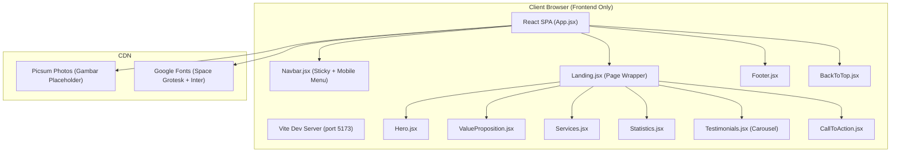

# Technical Architecture Document — Terra Tech Company Profile

**Versi**: 1.0  
**Fase**: Frontend Only (TIDAK ADA backend & database)  
**Scope**: Landing Page + Reusable Layout Components (Navbar, Footer)

---

## 1. Architecture Design

Hanya frontend single-page, tanpa backend integrasi. Semua data mock hardcoded di frontend.



---

## 2. Technology Description

- **Frontend Framework**: React `^19.2.8` (JSX format, tanpa TypeScript — sesuai project awal user)
- **Build Tool**: Vite `^8.2.0`
- **Styling Framework**: Tailwind CSS `^3.4.x` (setup manual: tailwind.config + postcss.config)
- **UI Component Library**: shadcn/ui komponen pilihan (Button, Card, Carousel via Embla)
- **Carousel Library**: `embla-carousel-react` (Ringan, shadcn Carousel menggunakan ini)
- **Icons**: `lucide-react` (Ikon stroke modern, sesuai panduan)
- **Animasi**: CSS Transitions Tailwind + Custom Hook `useInView` (IntersectionObserver) untuk on-scroll reveal
- **Smooth Scroll**: CSS `scroll-behavior: smooth` + anchor `id` pada setiap section
- **Fonts**: Google Fonts via `<link>` di `index.html` (Space Grotesk + Inter)
- **Backend**: **TIDAK ADA** (pure frontend mock)
- **Database**: **TIDAK ADA** (semua data inline di file komponen / `src/data/*.js` jika perlu)
- **Package Manager**: npm.cmd (sesuai Windows PS Execution Policy)

---

## 3. Route Definitions

Untuk fase awal (hanya landing page), **belum menggunakan react-router**. Semua section ditumpuk di 1 page dengan anchor ID untuk smooth scroll. Jika nanti ditambahkan page lain (About, Services Detail, Contact), baru install `react-router-dom`.

| Route | Purpose | Komponen Halaman |
|-------|---------|------------------|
| `/` (root, default) | Landing Page utama | `Landing.jsx` (berisi Hero → Value → Services → Stats → Testimonials → CTA) |

Anchor IDs untuk navigasi internal Navbar:
- `#home` → Hero Section
- `#keunggulan` → Value Proposition
- `#layanan` → Services
- `#statistik` → Statistics
- `#testimoni` → Testimonials
- `#kontak` → CTA Akhir & Footer

---

## 4. API Definitions (TIDAK ADA)

Karena **Frontend Only tanpa backend**, **tidak ada API call** di project ini. Semua data mock langsung didefinisikan sebagai JavaScript Array literal di masing-masing komponen section, atau di `src/data/mockData.js` jika ingin terpusat.

Contoh struktur data mock di file komponen:
```js
const services = [
  { id: 1, title: "Web Development", desc: "...", image: "https://picsum.photos/..." },
]
```

---

## 5. Server Architecture Diagram (TIDAK ADA)

Tidak ada backend/server logic.

---

## 6. Data Model (TIDAK ADA)

Tidak ada database. Data hardcoded mock di source code.

---

## 7. Struktur Folder (Target Setelah Setup)

```
terra-tech-frontend/
├── public/
│   ├── favicon.svg
│   └── icons.svg
├── src/
│   ├── assets/                      # Gambar lokal & aset statis
│   │   ├── hero.png
│   │   ├── react.svg
│   │   └── vite.svg
│   ├── components/                  # Reusable UI components
│   │   ├── layout/                  # Layout wrapper components
│   │   │   ├── Navbar.jsx           # Navbar sticky + mobile menu
│   │   │   └── Footer.jsx           # Footer reusable
│   │   ├── sections/                # Per-section di Landing Page
│   │   │   ├── Hero.jsx
│   │   │   ├── ValueProposition.jsx
│   │   │   ├── Services.jsx
│   │   │   ├── Statistics.jsx
│   │   │   ├── Testimonials.jsx     # Include carousel logic
│   │   │   └── CallToAction.jsx
│   │   ├── ui/                      # shadcn/ui components (generated)
│   │   │   ├── Button.jsx
│   │   │   ├── Card.jsx
│   │   │   └── Carousel.jsx
│   │   └── BackToTop.jsx            # Floating BTT button
│   ├── hooks/                       # Custom React hooks
│   │   └── useInView.js             # IntersectionObserver trigger (animasi scroll)
│   ├── pages/                       # Page-level components
│   │   └── Landing.jsx              # Komposit semua sections
│   ├── utils/                       # Helper functions
│   │   └── cn.js                    # shadcn classnames helper (clsx + tailwind-merge)
│   ├── data/                        # (Opsional) Data mock terpusat
│   │   └── mockData.js
│   ├── App.jsx                      # Root app: render Landing + Navbar/Footer
│   ├── App.css                      # Bisa dihapus setelah pakai Tailwind
│   ├── index.css                    # Tailwind directives + base styles + fonts
│   └── main.jsx                     # Entry point React
├── .trae/
│   └── documents/
│       ├── PRD_TerraTech_LandingPage.md
│       └── Technical_Architecture_TerraTech.md
├── components.json                  # shadcn/ui config
├── tailwind.config.js               # Custom theme: warna, fonts, animations
├── postcss.config.js                # PostCSS untuk Tailwind
├── vite.config.js                   # Vite config (tambah path alias @/)
├── jsconfig.json                    # Path alias resolver utk JS (karena bukan TS)
├── eslint.config.js
├── index.html                       # Tambahkan link Google Fonts
├── package.json
└── README.md
```

---

## 8. Dependencies List (Akan Diinstall)

### Production Dependencies (akan masuk `dependencies`)
| Package | Tujuan |
|---------|--------|
| `lucide-react` | Ikon (Shield, Clock, Trophy, Star, ArrowUp, Menu, X, dll) |
| `embla-carousel-react` | Engine Carousel untuk Testimonials section |
| `class-variance-authority` | shadcn/ui: cva utility (variant komponen) |
| `clsx` | shadcn/ui: class names combiner |
| `tailwind-merge` | shadcn/ui: merge tailwind classes aman (override conflict) |
| `tailwindcss-animate` | shadcn/ui: preset animasi (fade-in, accordion) |

### Dev Dependencies
| Package | Tujuan |
|---------|--------|
| `tailwindcss` | Core Tailwind CSS |
| `postcss` | PostCSS processor (Tailwind plugin) |
| `autoprefixer` | Auto vendor prefix CSS |

## 9. Tailwind Theme Customization (di `tailwind.config.js`)

Warna & font sesuai PRD section 4.1:
```
colors:
  dark:
    base:   '#0a0b14'
    surface:'#11131f'
    border: '#1e2139'
  accent:
    cyan:   '#00e5ff'
    purple: '#a855f7'
  text:
    primary: '#f0f4f8'
    secondary: '#94a3b8'
    muted:   '#64748b'
  rating:
    yellow: '#fbbf24'

fontFamily:
  display: ['"Space Grotesk"', 'sans-serif']   // Headline
  sans: ['Inter', 'system-ui', 'sans-serif']   // Body

Keyframes Custom:
  - 'fade-up': fade + translate 20px ke atas
  - 'glow-pulse': pulse opacity shadow cyan
  - 'count-up': counter number smooth
```
