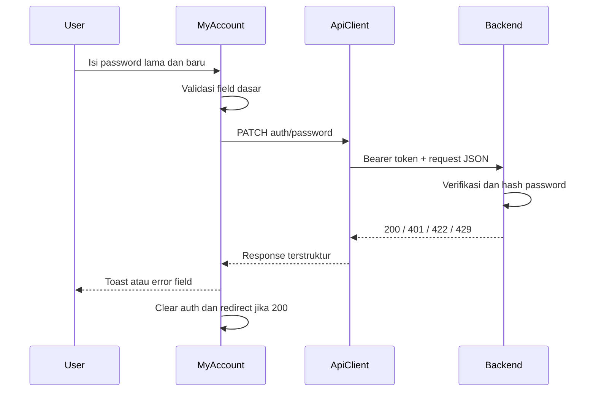

# WALKTHROUGH: Password Security Fix
## Perubahan Password Berbasis Backend

**Tanggal**: 2026-08-26  
**Status**: IMPLEMENTED  
**Prioritas**: CRITICAL

---

## Ringkasan

Fitur perubahan password pada `MyAccount.jsx` sebelumnya memvalidasi password lama di browser menggunakan credential hardcoded dan menyimpan password plaintext di `localStorage`. Implementasi ini sudah diganti dengan satu request ke backend.

Hasil perubahan:

- Password lama diverifikasi oleh backend.
- Password baru diubah melalui API resmi.
- Tidak ada credential demo atau password plaintext di frontend.
- Token autentikasi dibersihkan setelah password berhasil diubah.
- User diarahkan untuk login kembali dengan password baru.

---

## Kontrak Backend

### Endpoint

```http
PATCH /api/v1/auth/password
Authorization: Bearer <api_token>
Content-Type: application/json
Accept: application/json
```

Base URL berasal dari `VITE_API_URL`, sehingga frontend memanggil endpoint relatif `auth/password` melalui API client.

### Request

```json
{
  "current_password": "password_lama",
  "password": "password_baru",
  "password_confirmation": "konfirmasi_password_baru"
}
```

Backend bertanggung jawab untuk memverifikasi password lama, memvalidasi password baru, melakukan hashing, dan menyimpan perubahan ke database. Frontend tidak boleh membandingkan password lama dengan nilai lokal.

### Response yang Ditangani

| Status | Perilaku frontend |
|---|---|
| `200` | Form dikosongkan, toast sukses ditampilkan, session dibersihkan, redirect ke `/login`. |
| `401` | Session dianggap tidak valid. API client membersihkan token dan mengarahkan ke login. |
| `422` | Error field dari backend ditampilkan pada form password. |
| `429` | Pesan rate limit ditampilkan tanpa automatic retry. |
| Lainnya | Pesan error API ditampilkan atau menggunakan fallback yang aman. |

Contoh validation response:

```json
{
  "success": false,
  "message": "Validation failed",
  "errors": {
    "current_password": ["Password lama tidak sesuai"],
    "password": ["Password minimal 6 karakter"]
  }
}
```

---

## Perubahan Frontend

### 1. API Client

File: [src/api/client.js](src/api/client.js)

Ditambahkan method `patch(endpoint, body, options)` yang menggunakan HTTP method `PATCH`. API client yang sama tetap menangani:

- Header `Authorization: Bearer <api_token>` dari `localStorage["api_token"]`.
- Serialisasi JSON.
- Normalisasi response dan error.
- Cleanup session otomatis untuk response `401`.

### 2. API Service

File: [src/services/api.service.js](src/services/api.service.js)

`authService.changePassword()` memetakan nama parameter frontend ke kontrak backend:

```javascript
async changePassword(currentPassword, newPassword, confirmPassword) {
  return client.patch("auth/password", {
    current_password: currentPassword,
    password: newPassword,
    password_confirmation: confirmPassword,
  })
}
```

### 3. MyAccount

File: [src/components/dashboard/MyAccount.jsx](src/components/dashboard/MyAccount.jsx)

`handleChangePassword` sekarang:

1. Memastikan semua field terisi.
2. Memastikan password baru minimal 6 karakter.
3. Memastikan konfirmasi password cocok.
4. Memanggil `authService.changePassword(...)`.
5. Menampilkan error dari backend berdasarkan field jika response `422`.
6. Menangani status `401` dan `429`.
7. Mengosongkan form dan membersihkan key autentikasi setelah sukses.
8. Mengarahkan user ke `/login` agar login ulang dengan password baru.

> Validasi lokal hanya digunakan untuk feedback dasar form. Verifikasi password lama dan keputusan keamanan tetap dilakukan oleh backend.

### 4. Legacy Password Storage

Kode berikut sudah dihapus dari `MyAccount.jsx`:

- `passwordsMap`.
- `currentActualPassword`.
- Fallback credential seperti `admin123`.
- `localStorage["cms_user_passwords"]`.
- Sinkronisasi password saat update profile.
- Cleanup password map saat delete account.

Password hanya berada di state form selama proses input/request dan tidak disimpan ke `localStorage` atau `sessionStorage` oleh fitur ini.

---

## Alur Operasional



---

## Verifikasi Keamanan

### Pencarian Source Code

Jalankan dari root project:

```powershell
Get-ChildItem -Path src -Recurse -File -Include *.jsx,*.js |
  Select-String -Pattern "passwordsMap|currentActualPassword|cms_user_passwords|superadmin123|admin123|operator123|editor123"
```

Hasil implementasi: tidak ada match pada source code.

Pencarian tambahan untuk storage password:

```powershell
Get-ChildItem -Path src -Recurse -File -Include *.jsx,*.js |
  Select-String -Pattern 'localStorage.*password|sessionStorage.*password'
```

Hasil yang diharapkan: tidak ada penggunaan storage untuk password.

### Production Bundle

```powershell
npm run build
Get-ChildItem dist -Recurse -File |
  Select-String -Pattern "superadmin123|admin123|operator123|editor123"
```

Hasil yang diharapkan: build berhasil dan tidak ada credential demo di `dist`.

---

## Pengujian Manual

### Password Lama Salah

- Isi password lama yang salah dan password baru yang valid.
- Expected: backend mengembalikan error dan form menampilkan pesan password lama.
- Expected: tidak ada perubahan password.

### Password Baru Tidak Valid

- Gunakan password baru kurang dari 6 karakter.
- Expected: validasi dasar menghentikan request atau backend mengembalikan `422`.

### Konfirmasi Tidak Cocok

- Isi password baru dan konfirmasi yang berbeda.
- Expected: error konfirmasi ditampilkan dan request tidak dikirim.

### Rate Limit

- Ulangi request sampai backend mengembalikan `429`.
- Expected: pesan rate limit ditampilkan dan frontend tidak melakukan retry otomatis.

### Password Berhasil Diubah

- Isi password lama yang benar, password baru valid, dan konfirmasi yang sama.
- Expected: response `200`, form dikosongkan, toast sukses muncul, session dibersihkan, lalu redirect ke `/login`.
- Login ulang menggunakan password baru.

### Session Tidak Valid

- Gunakan token yang expired atau tidak valid.
- Expected: response `401`, token dibersihkan, dan user diarahkan ke login.

---

## Checklist Implementasi

- [x] Backend menjadi authority untuk verifikasi password lama.
- [x] Endpoint `PATCH /api/v1/auth/password` digunakan.
- [x] Request memakai `current_password`, `password`, dan `password_confirmation`.
- [x] Support HTTP `PATCH` ditambahkan ke API client.
- [x] Error `200`, `401`, `422`, dan `429` ditangani.
- [x] Credential hardcoded dihapus.
- [x] `cms_user_passwords` dihapus dari alur frontend.
- [x] Password tidak disimpan ke localStorage atau sessionStorage.
- [x] Session dibersihkan setelah password berhasil diubah.
- [x] Redirect login diterapkan setelah sukses.
- [ ] Jalankan dan verifikasi production build dengan `npm run build`.

---

## Catatan Deployment

Pastikan environment production memiliki `VITE_API_URL` yang menunjuk ke API HTTPS yang benar. Endpoint backend harus aktif dan menerima Bearer token yang disimpan sebagai `api_token`.

Sebelum deploy, jalankan:

```powershell
npm run lint
npm run build
```

Jangan memasukkan password nyata ke source code, dokumentasi publik, test fixture frontend, atau environment variable yang ikut masuk ke bundle browser.

---

**End of Walkthrough**
